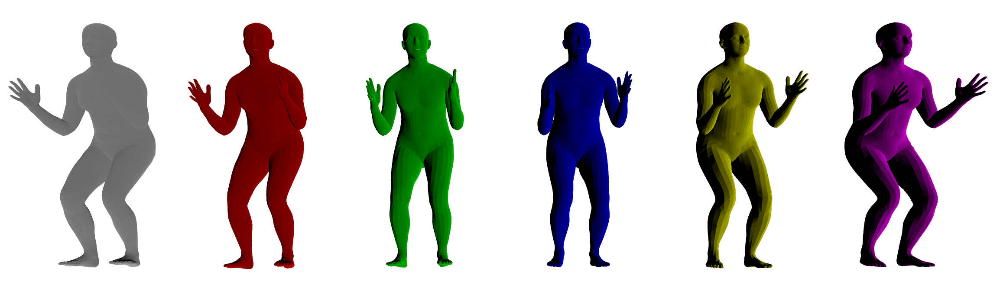
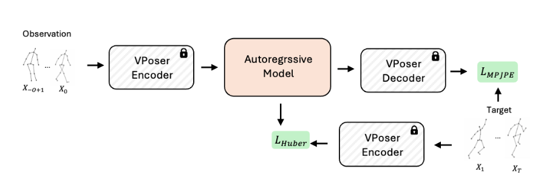

# Pose Forecasting with Autoregressive Model




This repository contains a simple implementation for pose forecasting with multiple autoregressive model. You can build on this code to develop your own ideas.

## Getting Started
### Installation
This code is running on Python 3.11 or later.
```
conda create -n pose python=3.11 -y
conda activate pose
git clone https://github.com/mlnjeongpark/Pose-Forecasting-Boilerplate.git
cd Pose-Forecasting-Boilerplate
pip install -r requirements.txt
```

### Preparation
Please download the [AMASS](https://github.com/nghorbani/amass) data and install the [VPoser](https://github.com/nghorbani/human_body_prior?tab=readme-ov-file#installation). Please organize the directories as:
```
Pose-Forecasting-Boilerplate
├── ...
├── data
│   ├── AMASS_CMUsubset
│   ├── dataset_all.pkl
│   └── VPoserModelFiles
├── dataset
│   ├── dataloader.py
│   ├── preprocess.py
├── ...
```

## Autoregressive Model Choice
To model future human motion, you can choose among <b>non-learned baselines</b> (e.g., `zero-velocity` and `constant-velocity`) and <b>trainable autoregressive models</b> (e.g., `MLP`, `RNN`, and `Transformer`.)

### Train
```
python train.py --model zero            # zero-velocity
python train.py --model constant        # constant-velocity
python train.py --model mlp              # mlp
python train.py --model rnn             # rnn
python train.py --model transformer     # transformer

```

You can change the configuration in `configs/pose.yaml`, such as the observation and prediction lengths, hidden dimension, and number of layers.<br>
Some configurations can also be overridden via command-line arguments when running train.py as:
```
python train.py --obs 15 --pred 30 --model mlp --layer 3 --dim 128
``````

The trained model will be saved in the `saved_model` directory.


### Visualization
You can save the visualization result to compare between the GT and predicted pose using `vis.py`. Please make sure to change the `ckpt_dir` in `vis.py`.
```
python vis.py
```
Also, the visualization of predicted poses from multiple models can be saved with:
```
python vis_all.py
```


For more details, please refer to this [report](assets/report.pdf).